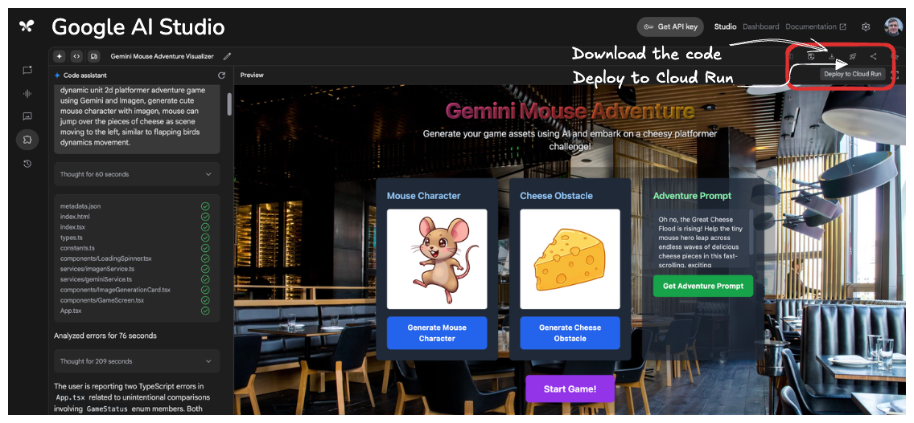
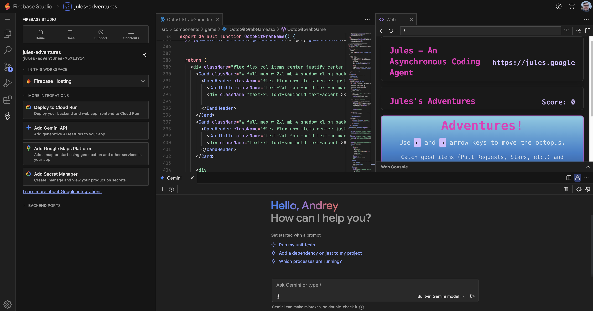
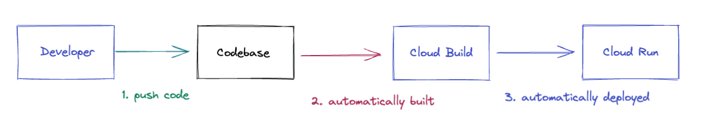
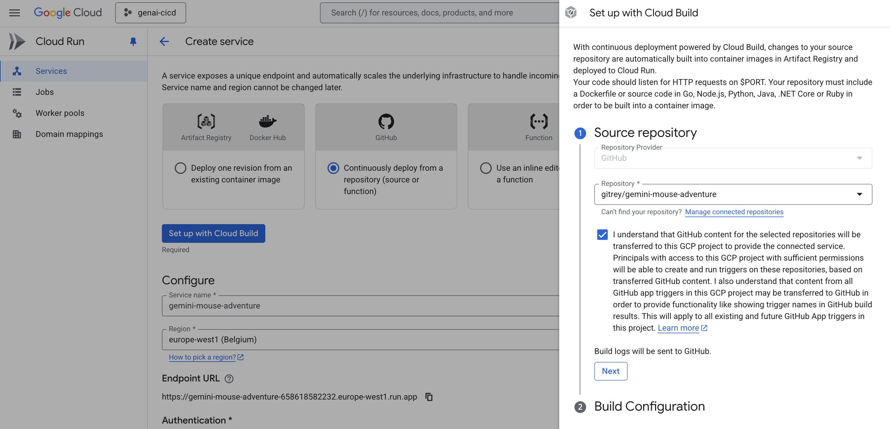

# So You've Built Your Idea and Want to Share It with the World?

---
**The opinions expressed in this article are solely those of the author([Andrey Shakirov](https://www.linkedin.com/in/andrey-shakirov-000b4a5/)) and do not reflect the views of their employer.**

---
### This is part # 3 in the series of articles on building and deploying applications on Google Cloud.

1.  [Design, Prototype, Build, and Deploy on Google Cloud: A Comprehensive Guide](https://github.com/gitrey/design-prototype-build-deploy-on-gcp)

2.  [So You want to build a GenAI Agent on Google Cloud?](https://github.com/gitrey/genai-agent-on-google-cloud)


## Deployment Options on Google Cloud

So you've implemented your innovative idea, turning that raw concept into a working application. Now, the next big step is to get it out there, accessible to users, reliably and at scale. This often means deploying a mix of frontend components (HTML, JavaScript, CSS, images) and your powerful backend code.

Google Cloud offers a robust ecosystem of services designed to host these assets, catering to every need from simple static sites to complex, scalable GenAI agents. Let's dive into your options.


## Table of Contents

*    [Deployment Options on Google Cloud](#deployment-options-on-google-cloud)
     *   [Frontend / Static Assets (HTML, JavaScript, CSS, Images)](#frontend--static-assets-html-javascript-css-images)
         *   [Firebase Hosting](#firebase-hosting)
         *   [Cloud Run](#cloud-run)
         *   [Cloud Storage with Cloud CDN](#cloud-storage-with-cloud-cdn)
     *   [Backend Code](#backend-code)
         *   [Cloud Run](#cloud-run-1)
         *   [App Engine](#app-engine)
         *   [Cloud Functions](#cloud-functions)
         *   [Google Kubernetes Engine (GKE)](#google-kubernetes-engine-gke)
         *   [Compute Engine](#compute-engine)
*    [Existing Integrations for a Smoother Ride](#existing-integrations-for-a-smoother-ride)
     *   [Google Cloud AI Studio](#google-cloud-ai-studio)
     *   [Firebase Studio](#firebase-studio)
     *   [Existing codebases - Cloud Run](#existing-codebases---cloud-run)
*    [Thoughts on Mobile Deployment Options](#thoughts-on-mobile-deployment-options)
     *   [Key Differences from Web App Deployment](#key-differences-from-web-app-deployment)
     *   [Core Mobile Deployment Phases](#core-mobile-deployment-phases)
     *   [Mobile Deployment Options & Tools](#mobile-deployment-options--tools)
         *   [1. App Store Platforms (Mandatory for Public Distribution)](#1-app-store-platforms-mandatory-for-public-distribution)
         *   [2. Beta Testing & Internal Distribution Tools](#2-beta-testing--internal-distribution-tools)
         *   [3. Continuous Integration/Continuous Delivery (CI/CD) for Mobile](#3-continuous-integrationcontinuous-delivery-cicd-for-mobile)
     *   [Backend for Mobile Apps (Overlap with Web Deployment)](#backend-for-mobile-apps-overlap-with-web-deployment)
     *   [Mobile Deployment Summary](#mobile-deployment-summary)
     *   [Conclusion](#conclusion)


### Frontend / Static Assets (HTML, JavaScript, CSS, Images)

For serving your static frontend assets, consider these GCP services:
*   **Firebase Hosting:**
    *   **Use Case:** Provides fast and secure hosting for web apps, static and dynamic content, and microservices. Offers features like free SSL certificates, custom domains, and easy integration with other Firebase services.
    *   **Considerations:** Excellent for rapid development and deployment, especially if you're already using other Firebase services.

*   **Cloud Run:**
    *   **Use Case:** While primarily for backend services, Cloud Run can also serve static frontend assets if they are packaged within a container image (e.g., using a web server like Nginx or Caddy). This can be useful if you want to serve both your frontend and backend from the same Cloud Run service or have specific serving logic for your static files.
    *   **Considerations:** Offers serverless scaling and can be integrated with Cloud CDN for caching. Might be overkill if you only have simple static files and no custom serving logic, where Firebase Hosting or Cloud Storage would be simpler.

*   **Cloud Storage with Cloud CDN:**
    *   **Use Case:** Simple, cost-effective way to host static websites. Cloud Storage stores your files, and Cloud CDN (Content Delivery Network) caches them at Google's edge locations worldwide for low-latency delivery to your users.
    *   **Considerations:** Ideal for static sites or the frontend components of a dynamic application.


### Backend Code

For your backend logic, GCP provides several compute options:

*   **Cloud Run:**
    *   **Use Case:** Fully managed serverless platform for deploying containerized applications. Scales automatically based on traffic, including scaling to zero.
    *   **Considerations:** Great for microservices, APIs, and web applications where you want to focus on code rather than infrastructure. Pay-per-use model.
*   **App Engine:**
    *   **Use Case:** Fully managed platform for building and running applications. Supports various languages and frameworks. Offers Standard and Flexible environments.
    *   **Considerations:** Good for web applications and APIs that require a platform-as-a-service (PaaS) experience with built-in scaling, versioning, and traffic splitting.
*   **Cloud Functions:**
    *   **Use Case:** Serverless, event-driven compute service. Run your code in response to events (e.g., HTTP requests, Cloud Storage changes, Pub/Sub messages) without managing servers.
    *   **Considerations:** Ideal for small, single-purpose functions, event processing, and lightweight APIs.
*   **Google Kubernetes Engine (GKE):**
    *   **Use Case:** Managed Kubernetes service for deploying, managing, and scaling containerized applications using Kubernetes.
    *   **Considerations:** Provides maximum flexibility and control but requires Kubernetes expertise. Suitable for complex microservice architectures and when you need fine-grained control over your infrastructure.
*   **Compute Engine:**
    *   **Use Case:** Provides virtual machines (VMs) running on Google's infrastructure. Offers complete control over the operating system and server configuration.
    *   **Considerations:** Use when you need full control over the environment, have existing applications to migrate, or require specific OS configurations. You are responsible for managing the VMs.

## Existing Integrations for a Smoother Ride

One of the biggest advantages of building on Google Cloud is the deep integration between services, which often streamlines your deployment process.

### Google Cloud AI Studio 

If you are using [Google Cloud AI Studio](https://aistudio.google.com), you can deploy your application as a **Cloud Run** service directly from the AI Studio interface. 
This integration simplifies the deployment process, allowing you to focus on building your application without worrying about the underlying infrastructure.




### Firebase Studio

[Firebase Studio](https://studio.firebase.google.com/) provides a streamlined way to deploy your applications, including both frontend and backend components. It integrates **Firebase Hosting** for static assets and **Cloud Run** for backend logic, making it easy to manage your entire application within the Firebase ecosystem.




### Existing codebases - Cloud Run

Have an existing codebase you want to deploy? Cloud Run offers fantastic continuous deployment capabilities powered by **Cloud Build**. This means changes to your source repository are **automatically built** into container images in **Artifact Registry** and then deployed to **Cloud Run**, creating a smooth, automated workflow.




```
Your repository must include a Dockerfile or source code in Go, Node.js, Python, Java, .NET Core or Ruby in order to be built into a container image.
```

Setup screen to connect your GitHub repository to Cloud Run:



You're hitting on a great point! While the previous article focused on web application deployment, mobile app deployment has its own distinct set of considerations and tooling.

Here are my thoughts on mobile deployment options, drawing parallels where possible to the web deployment article, but highlighting the unique aspects:

## Thoughts on Mobile Deployment Options

Deploying a mobile application (iOS or Android) is a fundamentally different beast than deploying a web application. While some backend services might overlap (e.g., using Cloud Run for your mobile app's API), the client-side distribution is heavily dictated by the respective platform ecosystems.

### Key Differences from Web App Deployment:

1.  **Platform-Specific Stores:** Unlike web apps that are accessed via a browser, mobile apps are primarily distributed through app stores (Apple App Store for iOS, Google Play Store for Android). These stores have strict guidelines, review processes, and require specific build formats.
2.  **Device Fragmentation:** Especially for Android, there's a vast array of devices, screen sizes, and OS versions to consider, impacting testing and compatibility.
3.  **Offline Capabilities:** Mobile apps often need robust offline functionality, which impacts data synchronization and storage strategies.
4.  **Native Features:** Accessing device-specific features (camera, GPS, notifications, sensors) requires native development or cross-platform frameworks that bridge to native APIs.
5.  **Update Mechanisms:** App updates are managed through the app stores, not directly by the developer's server (though in-app update prompts can be implemented).

### Core Mobile Deployment Phases:

Before considering specific tools, it's important to understand the typical phases:

1.  **Development & Testing:** Building the app, running unit tests, integration tests, and UI tests. This often involves simulators/emulators and physical devices.
2.  **Internal/Beta Testing (Pre-release):** Distributing the app to a limited group of testers (QA team, internal employees, select external users) for feedback and bug identification before public release.
3.  **App Store Submission:** Preparing the app and its metadata (screenshots, descriptions, privacy policy) for review by Apple or Google.
4.  **Public Release:** Once approved, making the app available to the general public via the App Store or Google Play.
5.  **Monitoring & Iteration:** Tracking app performance, crashes, user engagement, and planning future updates.

### Mobile Deployment Options & Tools:

#### 1. App Store Platforms (Mandatory for Public Distribution)

* **Google Play Console (Android):**
    * **Use Case:** The central hub for publishing and managing your Android apps. You upload APKs (Android Package Kit) or AABs (Android App Bundle), manage releases (alpha, beta, production tracks), view analytics, respond to reviews, and set up monetization.
    * **Considerations:** Requires a one-time registration fee. Strict guidelines and review processes. Supports phased rollouts for updates.
* **Apple App Store Connect (iOS):**
    * **Use Case:** The equivalent for iOS apps. Used for uploading IPAs (iOS App Archive), managing TestFlight builds (for beta testing), submitting for App Store Review, viewing sales reports and analytics, and handling agreements.
    * **Considerations:** Requires an annual Apple Developer Program membership fee. Very strict review process.

#### 2. Beta Testing & Internal Distribution Tools

These are crucial for getting feedback before hitting the public stores.

* **Firebase App Distribution:**
    * **Use Case:** A Google-owned service for distributing pre-release versions of your iOS and Android apps to trusted testers. It simplifies tester onboarding, build management, and integrates well with other Firebase services like Crashlytics.
    * **Considerations:** Excellent for rapid iteration with testers. Free to use within Firebase.
* **Apple TestFlight:**
    * **Use Case:** Apple's official beta testing platform for iOS, watchOS, tvOS, and macOS apps. It integrates directly with App Store Connect and allows you to invite internal and external testers.
    * **Considerations:** Required for external beta testing of iOS apps before App Store submission. Limited number of external testers without App Store Review.
* **Other Third-Party Tools:** (e.g., Microsoft App Center, Instabug, TestFairy) often offer broader support for different platforms, crash reporting, in-app feedback, and analytics beyond just distribution.

#### 3. Continuous Integration/Continuous Delivery (CI/CD) for Mobile

Automating the build, test, and distribution process is even more critical for mobile given the complexities.

* **Cloud Build (with Fastlane):**
    * **Use Case:** Google Cloud's CI/CD service can be configured to build your mobile app (iOS or Android) and integrate with tools like **Fastlane** to automate tasks like signing, uploading to App Distribution/TestFlight, or even directly to the app stores.
    * **Considerations:** Provides powerful automation for complex mobile pipelines. Requires setting up build configurations and managing credentials securely.
* **GitHub Actions / GitLab CI / Jenkins / CircleCI:**
    * **Use Case:** Popular CI/CD platforms that can be used to set up pipelines for mobile apps. They can compile code, run tests, and then trigger deployment steps using various plugins or custom scripts.
    * **Considerations:** Flexibility and extensive community support. Requires knowledge of configuring pipelines for mobile builds.
* **Dedicated Mobile CI/CD Platforms:** (e.g., Bitrise, Codemagic, Nevercode, Appcircle)
    * **Use Case:** These platforms are specifically designed for mobile CI/CD, offering pre-configured environments, integrated signing, and direct integrations with App Store Connect and Google Play Console, simplifying the setup process for mobile teams.
    * **Considerations:** Often come with mobile-specific features like device farms for testing. Can be more expensive than general-purpose CI/CD tools, but offer greater convenience.

### Backend for Mobile Apps (Overlap with Web Deployment)

Many mobile apps require a backend for data storage, user authentication, push notifications, and business logic. The options mentioned in the web deployment article are highly relevant here:

* **Cloud Run:** Excellent for serverless APIs and microservices that your mobile app consumes.
* **Firebase (BaaS - Backend-as-a-Service):**
    * **Use Case:** A comprehensive suite of tools particularly popular for mobile development. Includes Firestore (NoSQL database), Authentication, Cloud Functions (for serverless backend logic triggered by mobile events), Cloud Messaging (push notifications), and Storage.
    * **Considerations:** Highly integrated, rapid development, scales well. Can abstract away much of the traditional backend infrastructure management.
* **App Engine:** For more traditional, full-stack backends.
* **Cloud Functions:** For specific event-driven backend logic (e.g., processing image uploads from a mobile app).

### Mobile Deployment Summary

Mobile deployment requires a nuanced approach due to the app store ecosystems. While your backend infrastructure might leverage similar GCP services as web apps (Cloud Run, Firebase, etc.), the client-side distribution hinges on platforms like Google Play Console and Apple App Store Connect, often supplemented by tools like Firebase App Distribution and robust CI/CD pipelines to manage the complexities of building, testing, and releasing across different mobile platforms.

### Conclusion

You've built something awesome, and Google Cloud offers a powerful, flexible, and scalable set of services to help you share it with the world. Whether you're just getting started with a simple static site or scaling a complex application, you have a clear path to deployment.

From the rapid, integrated deployments offered by Firebase Hosting and Cloud AI Studio to the unparalleled scalability of Cloud Run, or the fine-grained control of GKE and Compute Engine, Google Cloud has a solution for every stage of your startup's journey. The key is to choose the services that best fit your current needs, allow you to iterate quickly, and provide the headroom for future growth.